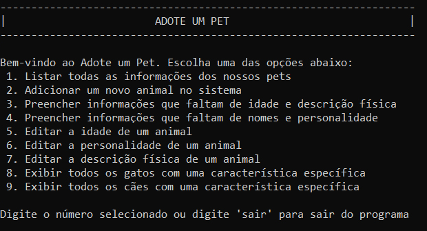
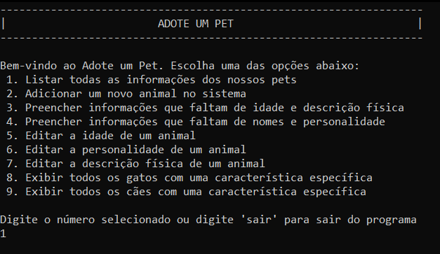
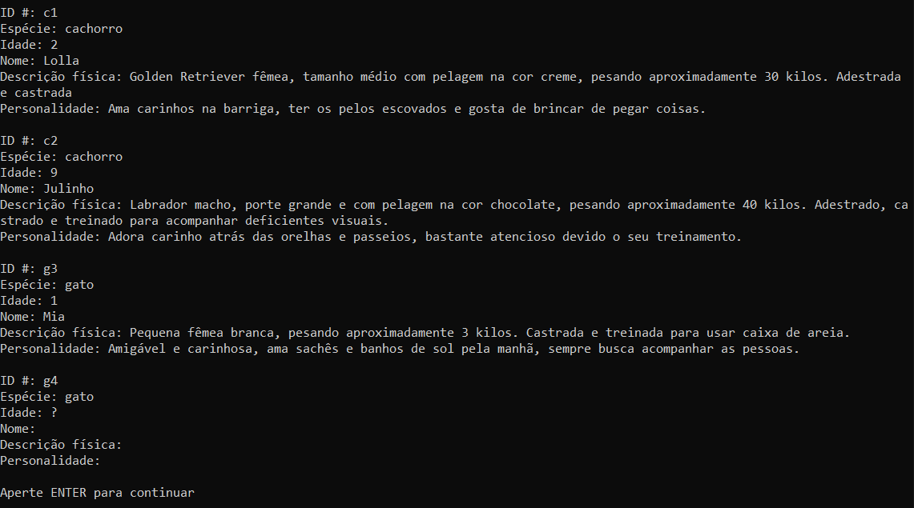

# 
Adote um Pet

  <a href="#-sobre">Sobre o projeto</a>&nbsp;&nbsp;&nbsp;|&nbsp;&nbsp;&nbsp;
  <a href="#-projeto">Como funciona</a>&nbsp;&nbsp;&nbsp;|&nbsp;&nbsp;&nbsp;
  <a href="#-layout">Sugestões</a>&nbsp;&nbsp;&nbsp;|&nbsp;&nbsp;&nbsp;
  <a href="#memo-licença">Licença</a>

  

## Sobre o projeto
Este projeto foi desenvolvido a partir dos exercícios presentes no curso de C# ministrado pela plataforma freeCodeCamp em parceria com a Microsoft.

No projeto original do curso, o menu principal do aplicativo apresentava 8 itens, sendo eles:

1. Listar os animais cadastrados
2. Cadastrar um novo animal
3. Preencher informações de idade e descrição física
4. Preencher informações de nome e personalidade
5. Editar a idade de um animal
6. Editar a personalidade de um animal
7. Exibir todos os gatos com uma característica específica
8. Exibir todos os cães com uma característica específica

Destes itens, através de estudos guiados e desafios, ao final do curso faltava terminar as opções 5 e 6 para que o aplicativo ficasse com todas as suas funções completas e em condições de uso.

Trabalhei nestas duas funções tendo como base o que aprendi, além de alterar um pouco como as informações eram apresentadas e inclui mais um item no menu, tornando possível também editar a descrição física de um animal.

## Como funciona
Ao abrir o aplicativo, o usuário se depara com o menu inicial:

A partir deste menu, o usuário pode escolher qual das funções deseja acessar digitando o número da opção e apertando ENTER em seguida. Por exemplo, vamos escolher a opção de listar todos os animais presentes no sistema.

Por fim, o aplicativo exibe as informações necessárias na tela para aquela função e, depois que aquela função está completa, ele solicita ao usuário que pressione a tecla ENTER para retornar ao menu inicial.

## Sugestões

Se você visualizou este projeto e tem dicas de como melhorá-lo ou encontrou algum erro, sinta-se a vontade para abrir uma issue! Eu vou ficar bem agradecido em receber qualquer feedback para melhorar meu aprendizado.

## Licença

Esse projeto está sob a licença MIT.

---